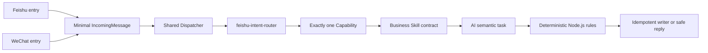

# LLW Personal AI Skill Platform

这是一个运行在个人设备上的消息驱动 AI 助手。飞书和微信提供两个入口，消息进入系统后共用同一套安全门、意图路由、业务能力、确定性规则和写入器。目前稳定能力包括每日工作记录与发票归档。

本仓库保存运行组件。业务语义合同单独保存在 [llw-personal-ai-skills](https://github.com/ccrt26/llw-personal-ai-skills)，从而让“AI 应该理解什么”和“程序必须怎样执行”保持清晰边界。

## What This Project Does

系统把私聊中的自然语言、图片或 PDF 转换成一个最小内部消息，再选择唯一业务能力：

- 每日工作：创建、补充、澄清、取消或忽略一条工作记录；
- 发票归档：识别清晰完整的单张发票，执行固定资格检查，并将用户发送的原始文件安全归档；
- 模型控制：用显式命令查看或切换允许的模型状态，自然语言不会偷偷改变模型。

系统不会让模型直接决定文件路径、覆盖文件或绕过资格规则。AI 负责理解非确定性内容，Node.js 负责固定判断、安全、幂等和落盘。

## Current Capabilities

| 能力 | AI 的职责 | 确定性程序的职责 |
|---|---|---|
| 统一意图路由 | 在已启用能力中选择一个，或返回澄清/不支持 | 限制输入、校验严格 Schema、只执行一个能力 |
| 每日工作 | 理解创建、补充、澄清、取消和忽略语义 | 校验目标日期与记录、按顺序写入、避免重复 |
| 发票归档 | 从一张清晰完整的图片或 PDF 提取规定票面事实 | 核验购买方、税号和餐饮类别，按月份和金额命名，安全归档原文件 |
| 模型选择 | 不由模型自行决定 | 只接受显式两态命令，失败时安全回到 Codex |

完整的当前事实和限制见 [项目概览](docs/PROJECT_OVERVIEW.md)。

## How One Message Is Processed



入口只负责把平台事件转换成内部格式并把回复送回原会话。飞书和微信在 `IncomingMessage` 之后不是两套业务系统；两者共用 Dispatcher、Router、Capability、业务规则与 writer。

图片和 PDF 会先经过通用的受限附件准备。PDF 只使用一个受保护的 PDFium 处理器完成结构、加密、页数、文本和全部页面渲染检查，成功后才进入视觉路由。详细设计见 [V3.6.3 单一 PDFium 发票 PDF 处理器](docs/superpowers/specs/2026-07-26-pdfium-only-invoice-pdf-design.md)。

## Skills, Capabilities, and Deterministic Rules

- **Skill**：定义 AI 的业务语义、输入输出合同和评测，不接触原始平台字段。
- **Capability**：运行时执行单元，取得已标准化消息和已准备附件，调用对应语义任务。
- **AI semantic task**：读取或分类不能靠固定代码可靠解决的内容，例如意图或票面事实。
- **Deterministic rule**：程序根据 AI 已提取的事实执行固定资格、安全和命名规则。
- **Writer**：只负责受约束、可恢复、幂等且不覆盖的持久化。

这些层次不得混用。例如，`invoice.visual` 是语义任务，不是一个独立 Skill；`filing-invoices` 定义发票提取合同，但不直接决定路径或写文件。

## Models

- Codex 支持文本路由、每日工作理解、视觉路由和发票视觉提取。
- DeepSeek 只在显式启用并手工切换后支持规定的文本任务。
- 图片、PDF 和发票视觉任务保持使用 Codex；系统不会在 DeepSeek 失败后暗中改用 Codex。
- 推理强度属于具体语义任务的配置。没有明确业务任务时，不为“可能需要思考”预建新 Skill。

## Safety and Privacy

- 密钥与令牌不进入仓库、普通日志或业务资料。
- 业务 Skill 只接收最小内部字段，不读取原始飞书或微信事件。
- 不把真实发票、消息正文、平台标识或本机业务路径作为测试夹具提交。
- 附件先做文件类型、大小、普通文件、符号链接和资源上限检查。
- AI 输出必须通过严格 Schema；未知字段和不安全值失败关闭。
- 写入器使用哈希、事务和排他创建，重复内容不覆盖既有文件。
- 日志只保留有界技术类别，不记录票面内容。

## Repository Guide

- [`src/core/`](src/core/)：最小消息、Dispatcher、Router、模型和安全边界；
- [`src/capabilities/`](src/capabilities/)：每日工作与发票运行能力；
- [`src/adapters/`](src/adapters/)：飞书和微信的薄入口、下载与回复适配；
- [`test/`](test/)：组件、合同、安全和端到端回归；
- [`docs/PROJECT_OVERVIEW.md`](docs/PROJECT_OVERVIEW.md)：当前架构与已验证基线；
- [`docs/superpowers/specs/`](docs/superpowers/specs/)：经确认的设计；
- [`docs/superpowers/plans/`](docs/superpowers/plans/)：对应实施计划。

## Recommended Reading Order for AI Review

建议把以下公开文件依次交给 ChatGPT 或其他评审者：

1. 本 README；
2. [项目概览](docs/PROJECT_OVERVIEW.md)；
3. [V3.6.3 PDFium 设计与验收](docs/superpowers/specs/2026-07-26-pdfium-only-invoice-pdf-design.md)；
4. [Skills 仓库 README](https://github.com/ccrt26/llw-personal-ai-skills)；
5. Skills 仓库中三个当前集成合同的 `SKILL.md`、Schema 和评测文件。

公开文档描述的是经过脱敏的架构和版本快照。实时生产配置、身份、密钥和业务资料不在 GitHub，评审时不应要求用公开仓库推断这些值。

## Development and Verification

需要 Node.js 24 或更高版本：

```bash
npm test
```

测试覆盖严格输入输出、路由唯一性、模型边界、附件准备、PDFium、飞书/微信共享链路、业务规则、幂等写入、状态恢复和安全失败。修改具体组件前还应遵守仓库内相应维护说明。

## Current Baseline

截至 2026-07-26：

- V3.6.3 单一 PDFium 发票 PDF 链路已完成实现、原子部署和正式微信验收；
- 组件完整回归为 `326/326`；
- 飞书与微信使用同一条入口之后的业务处理链；
- 正式发票视觉任务的有效模型保持 Codex；
- 生产运行件、配置与回滚点均按受保护边界管理。

可变化的提交、运行件和验收细节统一记录在 [项目概览](docs/PROJECT_OVERVIEW.md)，避免多个入口文档长期漂移。
