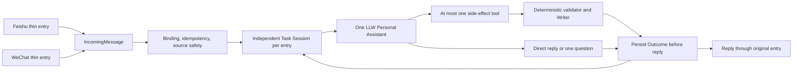

# LLW Personal Assistant

LLW 私人助手是一个本机优先、双入口、AI-first 的个人工作流系统。飞书和微信只负责接收自然语言与文件、把结果送回原会话；两边共用同一个 LLW Personal Assistant、同一组安全工具、Writer、Outcome 和恢复逻辑。

当前生产版本为 V4.2.5。

## 当前能力

- 自然语言直接回复、总结、比较和提取信息；
- 自然语言加 0–8 个文件组成一个任务；
- 飞书和微信各有一个独立、可持续的当前 Task Session；
- 同通道后续文字、文件、补充、回答和修正继续加入当前任务；
- 普通来源保留到明确结束、取消、替换或 24 小时不活动；
- TXT、Markdown、DOCX、PPTX、XLSX、安全图片，以及包含扫描页、没有文字层的
  PDF；
- 每日工作记录；
- 单张或多张餐饮发票归档；
- 明确要求的知识入库，并可保留多个原始文件；
- DOCX、PPTX、XLSX 文件生成；
- 飞书和微信同一核心、同一幂等与回复恢复；
- 微信或飞书文字中的 B 站/抖音公开视频链接，由同一个 Codex 根据完整音轨
  时间戳和覆盖完整时间线的真实画面理解；
- Codex 为主，DeepSeek 只保留已批准的纯文字每日工作子集。

V4.2.5 只启用 B 站和抖音两个公开视频门。原生语音、音频文件、直接发送的
本地视频和普通网页仍固定关闭；系统会返回明确的“不支持”，不会假装已理解。
没有安装 FFmpeg、本地 ASR、第三方视频理解模型或通用媒体平台。

飞书云文档的只读快照链已经实现，但真实生产验收因企业审批权限暂缓；它不是当前已验收能力。普通上传文件不受此遗留项影响。

## 一个任务如何处理



附件是 AI 的处理对象，自然语言是“要做什么”。微信或飞书把文字和文件拆成相邻事件时，静默窗口只负责安排何时开始处理，不决定它们属于哪个任务。每条同通道输入先持久增加任务 revision；AI 的追问、阶段性回复或失败都不会关闭任务。

Codex 在当前私有任务目录中以只读模式查看原始文件。普通来源在任务期间保持相同 SHA-256，用户无需因为追问、补充或重试重新发送。程序在 AI 前只做来源取得、格式与资源安全检查，不先替 AI 做业务解释。模型只能返回直接回复、一个问题或一个工具调用；它不能直接写资料库，也不能提前宣称成功。

PDF 在调用 Personal Assistant 前由现有受保护 PDFium 运行件统一检查。可用文字
和按页 PNG 作为任务拥有的派生证据保留，严格核对原件哈希、页序、图片哈希和
覆盖状态后才交给 Codex；相同来源的补充和失败重试复用同一份证据，不重新下载。

明确的“暂停”“结束当前任务”“取消当前任务”“开始新任务”或 24 小时不活动才改变任务边界。飞书任务不会改变微信任务，反之亦然。

## 四个副作用工具

| 工具 | 用途 | 关键边界 |
|---|---|---|
| `record_daily_work` | 创建或补充每日工作 | 北京时间、候选记录和原文规则由确定性程序复核 |
| `archive_dining_invoice` | 归档一张或一批餐饮发票 | 七字段、购买方、类别、哈希、幂等和命名由程序决定 |
| `save_knowledge` | 保存一个知识项及选定原件 | 资料库 key、目录白名单、无覆盖和原子发布 |
| `create_document` | 生成 DOCX、PPTX 或 XLSX | 文件输出工作区验证；不会自动进入知识库 |

每轮最多执行一个副作用工具。Writer 失败不会再次调用 AI；回复失败只重发已保存的 Outcome，不会重做业务。

## 安全与隐私

- 密钥和令牌不进入仓库、普通日志或业务资料；
- 不把平台标识、消息正文、真实发票或私人文件放入测试；
- 每个来源先检查普通文件、符号链接、扩展名、文件头、大小和容器边界；
- 每轮最多 8 个来源、单个 20 MiB、合计 80 MiB；
- AI 只得到有界指令、相对文件句柄和允许的工具定义；
- 写入器使用白名单、SHA-256、排他创建、事务、原子发布与无覆盖规则；
- Outcome 在回复前保存，支持服务重启后的安全恢复；
- 任务来源目录为所有者私有；在当前任务中保留，并在结束、取消、替换或过期后清理；
- 回复和 Writer 前复核 `taskId + revision`，运行中补充会阻止旧结果回复或写入；
- 生产 V7 主入口不静态加载旧 Router、Capability registry 或候选 normalizer。

## 模型边界

- Codex：文字、图片、PDF、Office、多来源、工具选择和文件生成；
- DeepSeek：仅已批准的纯文字每日工作子集；
- 不自动在模型之间回退；
- 不为 V4.2.5 安装 Office、WPS AI、新 AI 插件、FFmpeg 或本地 ASR。

## 仓库导航

- [`src/personal-assistant/`](src/personal-assistant/)：单一助手、Task Session、任务来源和四个工具；
- [`src/core/`](src/core/)：入口合同、幂等、模型和共享安全边界；
- [`src/adapters/`](src/adapters/)：飞书/微信下载、监听和回复适配；
- [`src/capabilities/`](src/capabilities/)：复用的 Writer、PDFium、Office 和历史回滚资产；
- [`test/`](test/)：纵向旅程、故障注入、回归与安全测试；
- [`docs/PROJECT_OVERVIEW.md`](docs/PROJECT_OVERVIEW.md)：当前架构、验收与遗留项。

业务语义主版本位于私有
[llw-personal-ai-skills](https://github.com/ccrt26/llw-personal-ai-skills)
仓库的 `llw-personal-assistant` Skill。

## 开发与验证

需要 Node.js 24 或更高版本：

```bash
npm test
```

V4.2.0 Phase 0 最终候选完整回归为 741/741；PDF/Coordinator 定向集为
18/18，冻结扫描 PDF 冒烟为 4/4，微信形态纵向候选集为 9/9。真实隔离 Codex
在 120 秒边界内读取一页无文字层扫描 PDF 并直接回复。生产微信验收随后证明：
PDF 单独发送后，后续“先总结，不保存”复用同一来源和真实 PDFium 页面证据，
得到直接回复、零工件、零 Writer；结束任务后会话和任务来源均已清理。

生产验收曾暴露 PDF-only 首轮在空指令时跳过页面准备的根因。修复先以失败测试
复现，再让 Coordinator 无论指令是否为空都先准备 PDF 证据；没有通过增加超时
掩盖问题。共享 Coordinator 改动后只再运行一次完整回归作为最终门禁。

具体生产 Git 状态、部署、回滚点、真实入口验收和飞书云文档审批状态由私有系统
地图维护，不把身份或本机业务路径写入仓库。

## V4.2.5 B 站/抖音公开视频

V4.2.5 已把 B 站和抖音公开视频作为两个独立门接入同一个 Personal Assistant：

```text
用户输入 B 站或抖音链接
→ B 站固定公开接口，或抖音无痕系统 WebKit，取得完整 M4A 和 MP4
→ 火山录音文件识别 1.0 返回带时间戳文字
→ AVFoundation/Core Media 生成覆盖开始到结尾的联系表
→ 同一个 Codex 结合声音和真实画面直接回复
```

生产打开 `bilibiliEnabled` 和 `douyinEnabled`；语音消息、音频文件、直接
视频文件和普通网页仍关闭。没有增加 Router、Agent、第五个副作用工具、第三方
视频理解模型、FFmpeg、本地 ASR 或自动模型回退。火山凭据只从 macOS 钥匙串
读取，19 小时试用硬上限由失败关闭的本地账本控制，已批准真实调用累计基线为
`516317ms`。

视频时间线 helper 使用已审计的 Apple 系统框架，固定工件 SHA-256 为
`b3b79f1770b49b75223d4a085ba41001256c985a3bde36d3317b9dd90a8f5a3f`。
抖音系统 WebKit helper 的固定工件 SHA-256 为
`ab6bde5c5a78c2bdfdcdc0dd6b05130055bf39c362d84ca488ac498f1e8605ac`。
30 分钟和 2 小时只属于早期候选保护值，生产不把它们当产品时长门槛；
当前只使用火山单文件小于 5 小时、32 MiB 音频、128 MiB 视频以及现有
超时/任务资源边界，超过时明确失败而不静默截断。
移除旧候选时长门槛后的最终共享核心完整回归为 852/852。真实 B 站样例
`BV1Y3Ne6hENH` 的部署前
无 ASR 读取取得完整
250.709 秒音视频并完成清理；不重复消费 ASR 额度来重做已经通过的相同证据。
真实抖音样例 `7648947659570515236` 取得 228.067 秒完整 M4A 和 49.5MB 完整
MP4，火山只提交一次并返回 53 个时间戳片段，画面时间线从开始到结尾共 46 个
采样、4 张联系表；同一个 Codex 直接回复，Writer 为 0。
