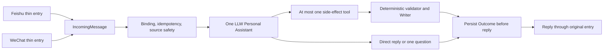

# LLW Personal Assistant

LLW 私人助手是一个本机优先、双入口、AI-first 的个人工作流系统。飞书和微信只负责接收自然语言与文件、把结果送回原会话；两边共用同一个 LLW Personal Assistant、同一组安全工具、Writer、Outcome 和恢复逻辑。

当前生产版本为 V4.0.1。

## 当前能力

- 自然语言直接回复、总结、比较和提取信息；
- 自然语言加 0–8 个文件组成一个任务；
- TXT、Markdown、DOCX、PPTX、XLSX、PDF 和安全图片；
- 每日工作记录；
- 单张或多张餐饮发票归档；
- 明确要求的知识入库，并可保留多个原始文件；
- DOCX、PPTX、XLSX 文件生成；
- 飞书和微信同一核心、同一幂等与回复恢复；
- Codex 为主，DeepSeek 只保留已批准的纯文字每日工作子集。

音频和视频在 V4.0.1 中明确不支持。系统会在下载、AI 和 Writer 之前返回具体的“不支持”结果，不会假装已理解。

飞书云文档的只读快照链已经实现，但真实生产验收因企业审批权限暂缓；它不是当前已验收能力。普通上传文件不受此遗留项影响。

## 一轮消息如何处理



附件是 AI 的处理对象，当前自然语言是“要做什么”。附件中的文字属于不可信数据，不能冒充用户命令。

Codex 在当前私有任务目录中以只读模式查看原始文件。程序在 AI 前只做来源取得、格式与资源安全检查，不先替 AI 做业务解释。模型只能返回直接回复、一个问题或一个工具调用；它不能直接写资料库，也不能提前宣称成功。

## 四个副作用工具

| 工具 | 用途 | 关键边界 |
|---|---|---|
| `record_daily_work` | 创建或补充每日工作 | 北京时间、候选记录和原文规则由确定性程序复核 |
| `archive_dining_invoice` | 归档一张或一批餐饮发票 | 七字段、购买方、类别、哈希、幂等和命名由程序决定 |
| `save_knowledge` | 保存一个知识项及选定原件 | 资料库 key、目录白名单、无覆盖和原子发布 |
| `create_document` | 生成 DOCX、PPTX 或 XLSX | 文件输出工作区验证；不会自动进入知识库 |

每轮最多执行一个副作用工具。Writer 失败不会再次调用 AI；回复失败只重发已保存的 Outcome，不会重做业务。

## 安全与隐私

- 密钥和令牌不进入仓库、普通日志或业务资料；
- 不把平台标识、消息正文、真实发票或私人文件放入测试；
- 每个来源先检查普通文件、符号链接、扩展名、文件头、大小和容器边界；
- 每轮最多 8 个来源、单个 20 MiB、合计 80 MiB；
- AI 只得到有界指令、相对文件句柄和允许的工具定义；
- 写入器使用白名单、SHA-256、排他创建、事务、原子发布与无覆盖规则；
- Outcome 在回复前保存，支持服务重启后的安全恢复；
- 临时任务目录在成功、失败、取消和启动恢复时清理；
- 生产 V6 主入口不静态加载旧 Router、Capability registry 或候选 normalizer。

## 模型边界

- Codex：文字、图片、PDF、Office、多来源、工具选择和文件生成；
- DeepSeek：仅已批准的纯文字每日工作子集；
- 不自动在模型之间回退；
- 不为 V4.0.1 安装 Office、WPS AI、新 AI 插件、音频转写或视频处理软件。

## 仓库导航

- [`src/personal-assistant/`](src/personal-assistant/)：单一助手、来源、对话和四个工具；
- [`src/core/`](src/core/)：入口合同、幂等、模型和共享安全边界；
- [`src/adapters/`](src/adapters/)：飞书/微信下载、监听和回复适配；
- [`src/capabilities/`](src/capabilities/)：复用的 Writer、PDFium、Office 和历史回滚资产；
- [`test/`](test/)：纵向旅程、故障注入、回归与安全测试；
- [`docs/PROJECT_OVERVIEW.md`](docs/PROJECT_OVERVIEW.md)：当前架构、验收与遗留项。

业务语义主版本位于私有
[llw-personal-ai-skills](https://github.com/ccrt26/llw-personal-ai-skills)
仓库的 `llw-personal-assistant` Skill。

## 开发与验证

需要 Node.js 24 或更高版本：

```bash
npm test
```

V4.0.1 最终收口回归为 591/591。回归包括真实 `IncomingMessage → Source Intake → Personal Assistant → Tool Definition → Writer → Outcome → Reply` 纵向测试，不用旧手工业务夹具替代生产入口。

具体生产提交、部署、回滚点、真实双入口验收和飞书云文档审批状态由私有系统地图维护，不把身份或本机业务路径写入仓库。
