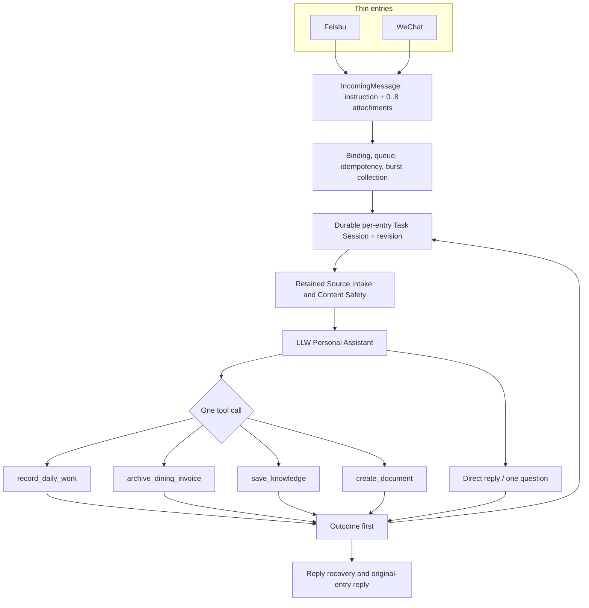

# LLW Personal Assistant V4.2.5 Project Overview

日期：2026-07-31

状态：V4.2.5 已部署；扫描 PDF、B 站和抖音公开视频理解已进入同一个 Personal Assistant

用途：供项目所有者、开发者和 AI 评审者理解当前生产架构

## 1. 目标与原则

V4.0.1 把历史上的多层语义链收敛为一个 LLW Personal Assistant；V4.1.0
把短消息轮次升级为每通道一个持续 Task Session；V4.2.0 Phase 0 为扫描 PDF
补齐通用视觉证据基础；V4.2.5 在不增加第二个助手或任务平台的前提下，把
B 站/抖音公开视频的完整音轨和完整时间线画面接入同一来源链：

```text
飞书 / 微信薄入口
  → 绑定、幂等和来源安全
  → 飞书/微信各自的当前 Task Session
  → 一个 Personal Assistant
  → 直接回复 / 询问一次 / 调用一个安全工具
  → Writer
  → Outcome
  → 原入口回复
```

核心原则：

1. 自然语言表达任务要求，文件是处理对象；同通道后续输入持续加入当前任务。
2. 程序在 AI 前只处理传输与安全，不提前替 AI 做业务语义判断。
3. 一轮可以查看多个来源，但最多执行一个副作用工具。
4. 工具参数定义只有一份，同时用于模型声明、执行校验和测试。
5. Writer 是唯一业务持久化者；AI 不能提前宣称写入成功。
6. 飞书和微信只是入口，各自保存一个独立当前任务，不各自建立业务系统。
7. 失败关闭、最小数据、可恢复、可回滚。

## 2. 当前生产架构



生产配置 version 7 只加载 `llw-personal-assistant`。旧 Router、Capability
registry 和候选 normalizer 已从 V7 静态启动链退出；旧版本兼容代码只在旧配置
回滚入口按需加载，历史还保存在 Git 和受保护回滚包中。

## 3. 消息与多来源

`IncomingMessage` 可以同时包含：

- 当前自然语言 `instructionText`；
- 0–8 个附件；
- 原入口的最小 `ReplyTarget`。

飞书或微信把文字与文件拆成相邻事件时，有界 burst collector 只决定何时启动一次处理，不决定任务边界。每条安全输入先持久增加当前通道任务的 `revision`；超过 15 秒、AI 已回复、AI 追问或一次处理失败，都不会让后续输入脱离当前任务。

首批资源限制：

- 每轮最多 8 个来源；
- 单个来源最多 20 MiB；
- 一轮总计最多 80 MiB；
- 支持 TXT、Markdown、DOCX、PPTX、XLSX、PDF 和安全图片；
- 多个明显相关文件默认作为一个来源集合交给一次 AI；
- 多个互不相关任务只问一次“合并还是拆分”，不自动调用多个工具。

当前用户要求优先于文件名和附件内容。例如“总结，不保存”必须零 Writer；附件正文即使含有命令式文字，也只被视为数据。

普通来源进入任务级只读工作区后保持到任务结束、取消、替换或 24 小时不活动。Writer 和回复前都复核 `taskId + revision`；运行中补充会让旧快照失效，旧结果不得写入或回复。

## 4. AI-first 原文件理解

Codex 运行在当前轮的私有任务目录：

- `cwd` 仅为当前轮工作区；
- sandbox 为只读；
- Vault 根目录不进入 AI 工作区；
- Office/PDF 通过安全相对路径查看；
- 图片通过多个视觉输入传递；
- 不授予任务网络权限。

PDF 在 Assistant 调用前通过现有 pypdfium2/PDFium 5.11.0 统一准备。程序把
核验后的文字、按页 PNG 和表示索引原子发布到任务来源工作区，逐项绑定原件
SHA-256、页序、图片 SHA-256 和覆盖状态。临时处理目录清理后证据仍归当前任务
所有；补充指令和失败重试复用相同证据，不重新下载或重复发布。

“AI 直接读原文件”不等于把平台附件无检查地交给模型。Source Intake 仍负责：

- 受限下载或云文档快照；
- 普通文件、所有权和权限；
- 扩展名、文件头和 OOXML/PDF 容器边界；
- 大小与总量；
- 安全相对路径、哈希和清理。

它不做业务摘要、不判断应调用哪个工具，也不把预解析结论当成 AI 的输入真相。

## 5. 四个确定性工具

### `record_daily_work`

AI 选择创建或补充目标；程序复核北京时间、候选记录、目标唯一性和原始用户文字，再调用既有 `VaultWriter`。

### `archive_dining_invoice`

支持一张或多张发票。批次在写入前完成全部硬规则校验；七个票面字段、购买方、餐饮类别、日期、金额、文件类型、哈希、命名、幂等和无覆盖由程序负责。批次中途 Writer 失败时返回可恢复的部分结果，不继续执行后续项目，也不重新调用 AI。

### `save_knowledge`

一个工具调用建立一个知识项，可以绑定 0–8 个当前来源并保留多个原件。模型只能使用允许的资料库 key；程序负责目录段、来源 ID、组合摘要哈希、原件命名、白名单、原子发布和重复幂等。

### `create_document`

生成 DOCX、PPTX 或 XLSX。文件先在私有输出工作区生成，再检查唯一工件、OOXML 类型、宏、加密、大小、普通文件、SHA-256 和稳定路径。生成文件不会自动保存到知识库。

## 6. Provider 边界

| 场景 | Codex | DeepSeek |
|---|---:|---:|
| 纯文字每日工作 | 支持 | 已批准子集支持 |
| 普通问答/知识整理 | 支持 | 不扩大 |
| 图片、PDF、Office | 支持 | 不支持 |
| 多来源任务 | 支持 | 不支持 |
| 文件生成 | 支持 | 不支持 |
| 发票视觉 | 支持 | 不支持 |

Provider adapter 只转换工具调用外壳，不理解业务、不做第二次路由，也不会在失败后自动切换模型。

## 7. 已验证的真实业务旅程

V4.0.1 已完成的业务验收继续有效。V4.1.0 新增并完成了真实微信持续任务验收：

- 先明确结束旧微信任务；
- 单独发送一份不含隐私的合成 TXT，助手追问用途；
- 稍后发送“总结，不保存、不生成文件”；
- 新任务最终为 revision 2 / resolvedRevision 2，保留同一份来源；
- 来源 SHA-256 与发送前合成文件完全一致；
- 两次阶段 Outcome 都已先持久化并回复；
- 最终直接回复，零工件、零回复文件、零知识库写入；
- 飞书当前任务保持为空，两个入口没有串扰。

V4.2.0 Phase 0 新增并完成了真实微信扫描 PDF 验收：

- 使用一页、无文字层、无私人数据的冻结扫描 PDF；
- 原件 SHA-256 为
  `9e041f0814412510771700af4af449d751c1fab883683261eef153ea4b778882`；
- PDFium 5.11.0 生成一页完整 PNG，页面 SHA-256 为
  `f65c1a27dd94a0707b1dd502c750c30fb31f0b4003ec8032726ebb3fb0675584`；
- 第一次干净 PDF-only 旅程暴露空指令会跳过 PDF reader 的根因，并在 120 秒
  边界安全失败；来源、任务和零 Writer 状态均保留；
- 失败测试先行的最小修复让 Coordinator 在任何指令状态下都先准备 PDF 证据；
- 同一来源随后接收“先总结，不保存”，真实 Codex 查看页面后直接回复；
- 最终 Outcome 已提交并回复，零工件、零回复文件、零 Writer；
- 明确结束测试任务后，微信 Task Session、兼容会话槽和任务来源工作区均为空。

既有生产验收还包括：

- 飞书文字知识保存；
- 微信“先发要求、后发三份文件”，合并为一个知识项并保留三个原件；
- 微信同轮三文件只读理解，零 Writer；
- 飞书和微信 PDF + 自然语言只读总结；
- 飞书每日工作；
- 飞书单张无文字餐饮发票自动归档；
- 微信两张餐饮发票批次归档；
- 已归档票据重复发送的真实幂等；
- 等待文件任务取消；
- 不支持音频/视频在 AI、下载和 Writer 前确定性拒绝；
- 服务重启后 Outcome/回复恢复不重复业务。

发票与知识工件验收均核对真实 Writer 结果、SHA-256、事务、Outcome、回复和临时清理。

## 8. 飞书云文档遗留项

飞书普通文档 → DOCX、表格 → XLSX、幻灯片 → PPTX、Wiki 解包后导出的代码和隔离纵向测试已经完成。真实飞书测试确认：

- 入口和链接识别已触发；
- 失败发生在 Source Intake 的用户身份权限检查；
- AI、工具和 Writer 均未运行；
- 零写入。

项目所有者因企业审批流程决定暂缓该能力，不阻塞 V4.0.1 其余发布。

当前固定版飞书 CLI 后续应一次申请并重新授权完整的五项增量权限：

- `drive:drive.metadata:readonly`
- `docs:document.content:read`
- `docs:document:export`
- `docx:document:readonly`
- `wiki:node:read`

重新授权必须保留现有身份和邮箱权限。当前实现不需要编辑、删除、移动、分享、协作者管理或上传权限；不得借此扩大授权。权限通过后必须分别验收普通文档、表格、幻灯片、Wiki 包装类型及含图片/表格块的文档。

## 9. V4.2.5 媒体边界

生产配置只打开 `bilibiliEnabled` 和 `douyinEnabled`。原生语音、音频文件、
直接发送的本地视频和普通网页四个配置开关固定为 `false`：

- 不支持的四类输入在来源取得、AI 和 Writer 前明确拒绝；
- 会议录音由用户先用外部工具转成文字，再按普通文字输入；
- 只有 B 站/抖音公开链接的临时视频音轨使用固定火山 ASR；
- 不安装 FFmpeg、本地 ASR、浏览器运行件或第三方视频理解模型；
- 站点、ASR 或任务资源的真实硬限制失败时明确说明，不设置人为 10 分钟门槛，
  也不静默截断。

项目所有者当前只有 Codex 套餐，没有独立 OpenAI API。火山 Key 只在 macOS
钥匙串；19 小时硬上限预留 1 小时，已批准真实调用基线为 `516317ms`，不得
自动购买或进入后付费。

## 10. 安全、状态与恢复

- 配置 version 7，状态继续使用已验证的 version 4 持久结构；
- 飞书和微信各最多一个 24 小时 Task Session，任务身份和来源完全隔离；
- 保存有界目标、阶段摘要、最近轮次、来源 ID、等待状态、revision 和 Writer checkpoint；
- 保护性 pending input 可保存最小通道回执目标，但不进入模型上下文；
- 任务工作区保留普通来源字节，状态只保存不透明来源 ID，不保存绝对来源路径；
- 不保存 token、完整模型输出或整个 Vault；
- 每个副作用先写真实 Writer，再由程序生成成功回执；
- Outcome 在回复前持久化；
- Writer 重试不重调 AI，回复重试不重做业务；
- 日志只保留阶段和有界错误码；
- 生产仍为一个 LaunchAgent、一个 Node.js 主进程和一条飞书事件消费链。

受保护回滚点包含完整组件/Skills Git bundle、配置恢复器、状态结构、LaunchAgent、PDFium 运行件事实、SHA-256 清单和隔离恢复证据；不包含密钥、平台标识、消息正文、真实发票或用户资料。

## 11. V4.2.0 Phase 0 验证与回滚

最终候选完整回归为 741/741；PDF/Coordinator 定向集为 18/18，冻结扫描 PDF
冒烟为 4/4，微信形态纵向候选集为 9/9，生产 hotfix 聚焦旅程通过。真实隔离
Codex 冒烟在 29.127 秒内返回一个有效直接回复，页面输入数为 1、Writer 为 0。

完整回归用于排除 Skill 加载、失败传播、来源工作区、模型图片输入、配置校验和
共享 Coordinator 的跨能力回退，不把“741 项通过”单独当作扫描 PDF 可用证据。
实际功能结论来自以下纵向链路：

```text
IncomingMessage
→ binding / idempotency / burst collection
→ durable per-entry Task Session revision
→ real Source Intake
→ retained task source workspace
→ Content Safety
→ Personal Assistant
→ frozen Tool Definition
→ real Writer or zero-write reply
→ Outcome
→ Reply / recovery
```

部署前建立了受保护的 V4.2.0 回滚点并从全新隔离目录完成恢复验证；原子切换前
另保存实时状态快照，PDF-only hotfix 前再建立第三个受保护回滚点。恢复副本哈希、
模式、Git 基线、配置/状态、PDFium 事实和 LaunchAgent 均一致，旧组件完整回归
675/675。

生产健康检查确认一个 Node 主进程、一个直属飞书消费者、心跳推进、当前模型
Codex、六个后续媒体开关关闭；真实微信测试任务已经明确结束并清理。该变更仍以
已批准生产 Git 基线为 HEAD、工作树尚未提交或推送，等待项目所有者单独批准 Git
操作。准确基线和回滚目录由工作区私有 `SYSTEM_MAP.md` 维护，不把本机身份或
业务路径写进仓库文档。

## 12. V4.2.5 B 站生产门

2026-07-31，B 站独立生产门获批并启用。它复用现有 TaskSourceWorkspace、
Coordinator、模型图片通道和一个 Personal Assistant，只新增受控 B 站来源、
固定火山视频 ASR adapter、失败关闭的 19 小时试用账本和一个固定哈希的
AVFoundation/Core Media 时间线 helper。

共享核心完整回归一次通过 842/842；排除抖音候选后的精确生产包通过 90/90
聚焦合同和微信形态纵向旅程。真实 B 站样例在部署前通过连接绑定 DNS 的默认
路径取得完整 250.709 秒 M4A/MP4，未调用 ASR，临时文件已清理。生产配置仍为
version 7；B 站部署阶段只把 `bilibiliEnabled` 设为 `true`，随后抖音门独立
通过后再把 `douyinEnabled` 设为 `true`。其余四个媒体门保持 `false`。
生产仍为一个 LaunchAgent、一个 Node 主进程和一条飞书消费链。

时间线 helper 工件 SHA-256 为
`b3b79f1770b49b75223d4a085ba41001256c985a3bde36d3317b9dd90a8f5a3f`。
部署前回滚包完成内容恢复和 Git bundle 验证；回滚元数据只记录配置/状态指纹
和结构，不复制密钥、平台标识、消息正文或用户文件。

## 13. V4.2.5 抖音生产门

2026-07-31，抖音使用项目所有者指定的
`https://v.douyin.com/hhw45Popmfc/` 完成真实门禁并独立启用。短链经过连接
绑定的公开地址解析，规范作品为 `7648947659570515236`；系统 WebKit 使用
非持久数据仓库，不读取登录、Cookie 或用户浏览器资料。

该样本取得 228.067 秒完整音频（1,483,867 字节）和完整 1920×1080 视频
（49,536,667 字节），不存在音频或视频前缀限制。唯一一次火山调用返回 53 个
时间戳片段；AVFoundation/Core Media 从开始到结尾生成 46 个连续采样范围，
最大间隔 4,959 毫秒和 4 张联系表。同一个 Codex 根据转写与画面正确概括剧情，
Writer 为 0，DeepSeek 未调用。

抖音 helper 固定 SHA-256 为
`ab6bde5c5a78c2bdfdcdc0dd6b05130055bf39c362d84ca488ac498f1e8605ac`。
上线收尾又用失败测试确认并移除了早期 30 分钟/2 小时候选时长门槛：
B 站、抖音和火山 adapter 现在只接受火山正式单文件小于 5 小时的上限，
同时继续执行 32 MiB 音频、128 MiB 视频、超时和任务资源边界。
共享配置和生产组合首次变更的完整回归为 846/846；移除旧候选时长门槛后，
最终代码在正常本机权限下完整回归 852/852。沙箱禁止本机假服务与合成媒体编码
造成的一次环境性失败不计为产品门禁，也没有调用外部服务。部署前“仅 B 站启用”回滚包已
完成内容恢复和 Git bundle 验证。生产仍为同一个 LaunchAgent、一个 Node
主进程、一个 Personal Assistant 和四个副作用工具。
