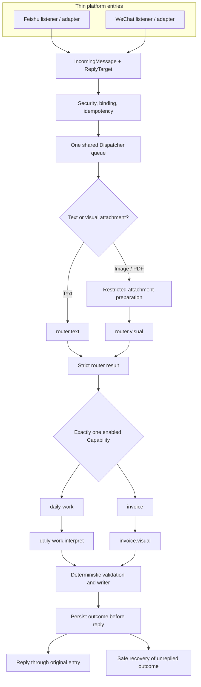

# Project Overview

日期：2026-07-26
状态：V3.6.3 已实现、部署并完成正式验收
用途：供项目所有者、开发者和 AI 评审者理解当前公开安全基线

## 1. Scope and Design Principles

LLW Personal AI Skill Platform 是一个本机优先、消息驱动的个人 AI 助手。当前运行组件接收飞书或微信私聊，将平台事件缩减为内部合同，再通过统一路由选择唯一能力。

当前稳定范围：

- 每日工作记录；
- 单张发票图片与 PDF 归档；
- 显式模型状态命令；
- 飞书和微信两个薄入口。

核心原则：

1. **一个语义，一个负责人。** Skill 定义 AI 语义，Capability 编排执行，Node.js 应用固定规则，writer 负责持久化。
2. **入口不同，核心相同。** 飞书和微信在内部消息之后共用同一套业务链。
3. **AI 提取事实，程序作固定决定。** 模型不生成最终文件路径、不绕过业务资格、不覆盖文件。
4. **失败关闭。** 无法验证的输入、输出、运行件或状态不会进入下一层。
5. **最小数据。** 每层只取得完成职责必需的数据。
6. **可回滚。** 配置、状态、运行组件、Skills 和受保护运行件必须存在一致的版本化恢复边界。

## 2. Shared Runtime Architecture



平台适配器可以有不同协议，但不得各自实现发票判断、每日工作语义或持久化规则。统一 Dispatcher 使用一条队列处理两个入口，并用入口相关的 outcome key 保持幂等。

## 3. Internal Message and Reply Boundaries

`IncomingMessage` 只保留运行核心需要的字段类别：

- 来源类型；
- 来源消息标识；
- 绑定用户和会话；
- 接收时间；
- 一段文本或一个受限附件描述；
- 最小 `ReplyTarget`。

飞书适配器从受限事件字段建立该对象。微信适配器先在自己的协议边界完成绑定、媒体取得与解密，再建立相同语义的对象。原始平台事件不会直接交给 Router 或业务 Skill。

`ReplyTarget` 只让 messenger 知道回复应回到哪个已绑定入口。业务 Skill 不需要知道平台 API 字段，也不能自行选择其他收件人。

## 4. Routing and Capability Boundaries

统一意图路由由 `feishu-intent-router` 定义。它只能返回三类结果：

- 路由到一个已启用 Capability，且置信度必须为 `high`；
- 提出一次有界澄清问题；
- 返回不支持或取消。

Router 不执行每日工作写入，不提取发票字段，也不依次尝试多个业务能力。

当前运行组件注册两个业务 Capability：

- `daily-work`：处理已经被路由为每日工作的文本；
- `invoice`：处理已经被路由为发票的单个已准备视觉附件。

路由合同来自业务 Skill 的版本化参考文件。组件启动时校验合同，只有显式启用的 Capability 才进入 Router 候选集合。

## 5. Business Skills

当前运行基线集成三个语义合同：

| Skill | 责任 | 不负责 |
|---|---|---|
| `feishu-intent-router` | 在已启用能力中选择一个，或澄清/拒绝 | 业务写入、发票字段提取 |
| `feishu-daily-work` | 解释每日工作创建、补充、澄清、取消和忽略 | 发票、附件和其他目录 |
| `filing-invoices` | 提取规定的发票事实、清晰度和文档状态 | 购买方资格决定、路径、写文件 |

这些合同、严格输出 Schema 和评测保存在 [llw-personal-ai-skills](https://github.com/ccrt26/llw-personal-ai-skills)。Skills 仓库还可能保存未接入当前运行组件的其他合同；文件存在不等于生产 Capability 已启用。

## 6. Model Support

运行时把模型支持绑定到四个语义任务，而不是笼统绑定到整个应用：

| 语义任务 | Codex | DeepSeek |
|---|---:|---:|
| `router.text` | 支持 | 显式启用时支持 |
| `router.visual` | 支持 | 不支持 |
| `daily-work.interpret` | 支持 | 显式启用时支持 |
| `invoice.visual` | 支持 | 不支持 |

模型只能由精确命令切换。每个新任务在开始时取得一个模型快照；进行中的澄清不会因全局状态变化而中途换模型。DeepSeek 禁用、状态无效或状态路径不安全时，有效状态安全回到 Codex。DeepSeek 调用失败不会偷偷转交 Codex。

推理强度属于具体任务配置。V3.6.3 的发票视觉任务继续使用 Codex，并保持既有推理设置。

## 7. Invoice Image and PDF Flow

图片和 PDF 都采用“先通用准备，再视觉路由，再复用准备结果”的顺序：

```text
一个飞书或微信附件
  → 下载到当前消息的私有临时目录
  → 文件头、扩展名、大小、普通文件和无符号链接检查
  → 图片：建立一个已准备页面
  → PDF：一个受限 PDFium 子进程完成结构、加密、页数、文本和全部页面 PNG
  → Node.js 复核固定清单和资源限制
  → router.visual 查看已验证页面，只选择 Capability
  → route: invoice / high
  → invoice Capability 复用同一准备结果
  → invoice.visual 按 filing-invoices 提取票面事实
  → Node.js 固定业务判断
  → writer 归档用户发送的原始文件
  → 清理全部临时准备文件
```

PDF 只使用 PDFium，不保留 Poppler 正常路径或回退。V3.6.3 选择 pypdfium2 `5.11.0` / PDFium `151.0.7920.0`，是因为同一真实电子发票在旧渲染路径丢失关键中文页面元素，而隔离验证证明 PDFium 可以完整渲染该类文档。

PDF 固定边界包括最多 10 页、文本最多 262,144 字节、渲染输出合计最多 100 MiB、页面最长边 3,508 像素和子进程 60 秒总时限。加密、结构、页数、文本、渲染和超时错误均映射为不包含票面内容的安全类别。

`router.visual` 不提取发票字段。`invoice.visual` 不决定是否归档。详细技术决定、测试矩阵和回滚要求见 [V3.6.3 单一 PDFium 设计](superpowers/specs/2026-07-26-pdfium-only-invoice-pdf-design.md)。

## 8. Deterministic Storage Rules

发票模型只提取合同规定的事实与清晰状态。Node.js 随后执行固定规则：

1. 输入必须是一张清晰完整的发票；多张或相互冲突的文档不处理。
2. 购买方名称和统一社会信用代码必须与受保护配置中的归档主体匹配。
3. 当前允许归档的类别是餐饮。
4. 日期只用于确定月份目录；金额只用于生成展示文件名。
5. 同月同金额依次使用 `金额`、`金额-2`、`金额-3`；跨月重新开始。
6. 发票号可用于识别票面事实，但不是额外业务资格门。
7. 原始图片或 PDF 才是归档对象，渲染页面不是归档副本。
8. SHA-256、事务记录和排他创建保证重复幂等且不覆盖。

若 AI 无法清楚读取资格所需字段、日期或金额，结果是暂不归档并提示重新发送清晰完整的单张原件。模型输出未知字段、Schema 不合法或存储值不安全时按技术失败关闭。

每日工作 writer 同样限制在配置的目标根目录，使用结构化动作、候选记录和原始用户文字完成可核验写入。

## 9. Security, State, and Rollback

- 密钥保存在受保护凭据系统中，不写入配置、仓库或普通日志。
- 运行配置与状态使用仅当前用户可读写的权限，并拒绝符号链接身份。
- 状态先保存 outcome，再发送回复；发送失败可以恢复同一回复而不重复业务工作。
- 附件临时目录属于单个消息 job，成功或失败都清理，启动时可继续清理遗留。
- PDFium 使用固定版本、逐文件哈希、许可证和受保护运行件；消息处理中不联网安装依赖。
- 部署前回滚点覆盖组件、Skills、配置、状态和运行件事实，但不包含凭据、消息正文、真实发票或业务资料。
- 版本恢复必须在隔离目录核对清单和测试。组件与配置需要原子切换，不允许新旧合同交叉运行。

公开仓库不包含实时本机状态。实时事实由私有系统基线维护，公开文档只记录已经确认且适合公开的日期快照。

## 10. Current Verified Baseline

以下是截至 2026-07-26 的已验证快照，不是永久不变的运行常量：

| 项目 | 已验证事实 |
|---|---|
| 组件 `main` | 已包含 V3.6.3 单一 PDFium rollout |
| 生产运行代码 | `d06da01` |
| Skills | `78433ab` |
| 当前组件完整回归 | `326/326` |
| 部署前旧基线隔离恢复回归 | `313/313` |
| PDF 运行件 | pypdfium2 `5.11.0` / PDFium `151.0.7920.0` |
| 发票有效模型 | Codex |
| 正式微信 PDF 验收 | 一个 `committed` 发票 outcome、一个工件、一个 `published` 事务 |
| 文件一致性 | 用户原始 PDF 与归档目标 SHA-256 相同 |
| 清理与恢复状态 | 临时遗留为零，待回复为零 |

正式验收还证明：附件只下载和准备一次；`router.visual` 只调用一次并选择唯一 invoice；`invoice.visual` 随后复用同一准备结果；成功后只归档用户发送的原始 PDF。

### 10.1 V3.7.0 默认禁用候选

`integration/v370` 已形成尚未部署、尚未启用的 `knowledge-ingest` 与
`assistant-work` 候选闭环。`knowledge-ingest` 处理明确要求保存的直接文字，单个 TXT、Markdown、
DOCX、PPTX 或 XLSX 来源，一个受支持的飞书云文档一次性快照，以及在受管资料根下
创建明确指定的空分类目录。

候选目录规则固定为：

- 已有规则能唯一匹配现有目录时直接选择；
- 用户明确给出的新目录可以创建；
- Skill 建议的新目录、多个可能目录或命名不唯一时，只提出一次确认；
- 移动、重命名、合并、覆盖、删除、批量整理和受管根外操作始终拒绝。

模型只得到不透明资料库 key、安全显示名、别名和经过程序验证的相对目录段，不得到
Vault 根、受管根绝对路径、其他私有 Skill、平台标识或回复目标。Node.js 重新校验严格
决策，并由不可覆盖 Writer 在同一文件系统中完成 staging、哈希、幂等和原子发布。

Office 文件仍只下载一次并只建立一个私有 job。程序在 AI 前检查 OOXML 文件头、
容器结构、条目和解压上限、必需部件、宏、加密、嵌入对象及外部关系；只把有界提取
文本交给一次 `knowledge.ingest` 语义任务。选择保留原件时，Writer 按原始 SHA-256
逐字节写入同一新知识项目录。飞书云文档只允许 `doc/docx`、`sheet` 和 `slides`
经现有用户身份导出一次 DOCX、XLSX 或 PPTX 快照；Wiki 必须先只读解析为其中一种。
不支持自动同步、权限申请、云端 WPS 转换或覆盖旧快照。

本机 WPS Office 用于用户现场文档任务和后续生成文件的打开、排版及兼容性验收。
后台附件链路不调用 WPS 的未公开 macOS 内部组件，也不把私人文件上传到需要应用密钥
的 WPS WebOffice。后台 OOXML 安全准备为本地确定性处理，不调用 AI 插件、不消耗额外
模型额度；语义理解仍保持一次 Codex 调用。

`assistant-work` 复用同一个 Dispatcher、Router 和 StateStore。它只搜索候选配置
允许的知识资料根，只读取有界 Markdown 正文，并把实际使用的 Vault 相对路径交给
严格决策校验。每个绑定用户首批最多一个开放 Task Session；会话固定 Codex 与
`source_strict`、`hybrid` 或 `creative` 模式。完整工作稿只保存在本机私有的受控
工作区中，按 `draft-vN.md` 新建版本，不进入长期知识库或状态正文；服务重启可以从
状态与工作区恢复。开放任务的明显续接仍进入 `assistant-work`，明确知识入库等独立
动作仍由统一 Router 分配，且不会删除当前工作稿。

受控文件输出候选现已把首批范围固定为 DOCX、PPTX 与 XLSX，每次最多一个文件；
PDF 与 Markdown 输出仍未加入。只有当前工作稿已经存在、用户明确指定唯一格式且
入口支持文件回复时才建立一个 workspace-write 私有 job。job 只得到当前工作稿，
并调用本地已安装的对应格式 Skill；不安装 Office，不调用 WPS AI 或云插件，不写
Vault。程序随后检查唯一固定输出、OOXML 结构、扩展名、普通文件、符号链接、大小、
宏、加密、额外文件和 SHA-256，再以程序规范化显示名原子发布到稳定受控目录。

Outcome 新增独立 `replyFiles`，保存稳定路径、显示名、MIME、SHA-256、大小和文件发送
幂等键。文字和文件均发送成功后才标记已回复；失败和服务重启都复用同一稳定工件，
不重新生成。现有 `lark-cli` 已验证具有本地文件上传并回复原飞书消息的真实合同；
微信 iLink 目前只有纯文字发送合同，因此微信文件输出在生成前明确拒绝，不伪装
成功、不返回本机路径、不切换平台。

合成 DOCX、三页 PPTX 和含两条公式的 XLSX 已由本地格式工具生成并在本机 WPS
Office 中打开验收：中文、页面结构、可编辑对象、表格与公式结果均正常。LibreOffice
预览器对 macOS 中文字体存在替代显示差异，因此最终兼容性结论以用户指定的 WPS
真实打开结果为准。

两个候选当前都保持双重禁用：

- `llw-knowledge-ingest` 私有 Skill allowlist 为 `enabled: false`；
- `llw-assistant-work` 私有 Skill allowlist 为 `enabled: false`；
- version 5 候选配置强制两项能力的 `enabled: false`。

因此本节只记录集成分支的可审查候选事实，不改变第 10 节的 V3.6.3 正式运行基线。
本阶段没有迁移正式配置、注册生产 Capability、重启服务或修改用户资料。
受控文件输出仍未启用：正式 `outputRoot` 与保留期需要在部署前由用户确定。该集成
候选仍未迁移正式配置、重启服务、发送真实文件或修改用户资料。
本阶段完整回归共 `453/453` 通过，零跳过、零取消；其中需要本地回环端口的
`deepseek-client` 27 项在允许回环的隔离环境中单独复核通过。

## 11. Deliberately Unsupported or Deferred Scope

当前明确不包含：

- PDF 的 Poppler 回退或第二 PDF 引擎；
- 自动 OCR 回退、PDF 自动修复或 OFD 支持；
- 多张发票自动拆分；
- 非餐饮发票归档；
- DeepSeek 视觉路由或发票视觉提取；
- 模型自动选择、自动降级或隐藏切换；
- 由业务 Skill 直接访问原始平台字段、凭据或任意本机目录；
- 因 README 更新而重启或改变生产服务。

这些项目只能在明确的新业务需求、书面设计、测试和回滚边界完成后加入。

## 12. Interfaces for Future Feature Design

后续功能讨论应先回答以下问题：

1. 它是新的业务语义，还是现有 Skill 的明确扩展？
2. Router 应该如何仅凭最小消息把它和现有能力区分？
3. 它需要哪一个新的或既有 Capability？
4. AI 只需要提取哪些事实？输出严格 Schema 是什么？
5. 哪些判断可以由 Node.js 确定性执行？
6. writer 的唯一目标、命名、幂等、覆盖和恢复规则是什么？
7. Codex 或 DeepSeek 分别支持哪些具体语义任务与推理设置？
8. 会新增哪些凭据、权限、网络、附件或隐私边界？
9. 最小评测、完整回归、隔离恢复和真实验收如何证明它可用？
10. 哪些实时事实只留在私有系统基线，哪些稳定设计可以公开？

满足这些接口后，再决定更新现有 Skill 还是创建新 Skill。没有明确语义合同的模型能力不应提前变成空泛的 Skill。
