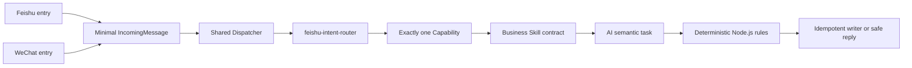

# Public Project Documentation Implementation Plan

> **For agentic workers:** REQUIRED SUB-SKILL: Use superpowers:subagent-driven-development (recommended) or superpowers:executing-plans to implement this plan task-by-task. Steps use checkbox (`- [ ]`) syntax for tracking.

**Goal:** Publish a public-safe, human- and AI-readable introduction to the LLW personal AI skill platform across the component and Skills repositories.

**Architecture:** The component repository provides the project entry point, current architecture baseline, and V3.6.3 technical record. The Skills repository provides a contract catalog for the three business Skills. Each mutable fact has one primary document, and the remaining documents link to it instead of duplicating details.

**Tech Stack:** Markdown, Mermaid, Node.js test runner, Git, GitHub

## Global Constraints

- This is documentation-only work; do not modify production code, configuration, services, dependencies, lock files, business data, or Git history.
- New and modified public documents must not contain machine absolute paths, business entity identifiers, platform identifiers, secrets, real message text, real invoices, or real invoice fields.
- The two message platforms must be described as separate entries into one shared Dispatcher, Router, Capability, business-rule, and writer system.
- `feishu-intent-router`, `feishu-daily-work`, and `filing-invoices` remain the only three documented business Skills.
- V3.6.3 keeps one PDF engine, PDFium, with no Poppler fallback.
- Public documents may report only verified, dated snapshots of commit, test, and acceptance facts.
- The component and Skills repositories must both be merged to `main` and pushed only after validation passes.
- The private system fact baseline is not copied into either public repository.

---

### Task 1: Component Repository Entry and Current Project Overview

**Files:**
- Create: `README.md`
- Create: `docs/PROJECT_OVERVIEW.md`
- Reference: `docs/superpowers/specs/2026-07-26-public-project-documentation-design.md`
- Reference: `docs/superpowers/specs/2026-07-26-pdfium-only-invoice-pdf-design.md`
- Reference: `src/core/semantic-tasks.mjs`
- Reference: `src/capabilities/index.mjs`
- Reference: `src/core/dispatcher.mjs`
- Reference: `src/core/incoming-message.mjs`
- Reference: `package.json`

**Interfaces:**
- Consumes: the approved public-documentation specification and verified V3.6.3 repository state.
- Produces: the public entry point and the single public source for the current architecture/version/acceptance snapshot.

- [ ] **Step 1: Create the component README with the exact stable sections**

Create `README.md` with these headings and responsibilities:

```markdown
# LLW Personal AI Skill Platform

## What This Project Does
## Current Capabilities
## How One Message Is Processed
## Skills, Capabilities, and Deterministic Rules
## Models
## Safety and Privacy
## Repository Guide
## Recommended Reading Order for AI Review
## Development and Verification
## Current Baseline
```

The processing diagram must show:



State in plain language that AI reads or classifies non-deterministic content, while Node.js applies fixed eligibility, safety, idempotency, and storage rules. Link detailed mutable facts to `docs/PROJECT_OVERVIEW.md`.

- [ ] **Step 2: Create the detailed project overview**

Create `docs/PROJECT_OVERVIEW.md` with these headings:

```markdown
# Project Overview

## 1. Scope and Design Principles
## 2. Shared Runtime Architecture
## 3. Internal Message and Reply Boundaries
## 4. Routing and Capability Boundaries
## 5. Business Skills
## 6. Model Support
## 7. Invoice Image and PDF Flow
## 8. Deterministic Storage Rules
## 9. Security, State, and Rollback
## 10. Current Verified Baseline
## 11. Deliberately Unsupported or Deferred Scope
## 12. Interfaces for Future Feature Design
```

Record the dated current baseline as:

- component `main` contains the V3.6.3 rollout;
- production runtime code was verified at `d06da01`;
- Skills were verified at `78433ab`;
- the component regression suite passed `326/326`;
- the isolated pre-deployment restore regression passed `313/313`;
- formal WeChat PDF acceptance produced one committed invoice outcome, one artifact, one published transaction, matching source/target SHA-256, zero temporary leftovers, and zero pending replies;
- PDFium runtime is pypdfium2 `5.11.0` with PDFium `151.0.7920.0`;
- effective invoice model is Codex; DeepSeek is not used for invoice visual work.

Mark all of these as a snapshot verified on 2026-07-26. Do not include a process ID, local directory, buyer identity, tax identifier, platform identity, invoice number, date, or amount.

- [ ] **Step 3: Verify the two documents before committing**

Run:

```bash
git diff --check
test -f README.md
test -f docs/PROJECT_OVERVIEW.md
rg -n '^## ' README.md docs/PROJECT_OVERVIEW.md
```

Expected: no diff errors, both files exist, and all specified headings are present.

- [ ] **Step 4: Commit the component entry documents**

```bash
git add README.md docs/PROJECT_OVERVIEW.md
git commit -m "docs: add public project overview"
```

Expected: one documentation-only commit on `agent/public-project-docs`.

---

### Task 2: Public-Safe V3.6.3 Technical Record

**Files:**
- Modify: `docs/superpowers/specs/2026-07-26-pdfium-only-invoice-pdf-design.md`
- Reference: `docs/PROJECT_OVERVIEW.md`

**Interfaces:**
- Consumes: the verified V3.6.3 deployment and formal acceptance facts.
- Produces: the detailed public technical source for the one-PDFium design and its completed acceptance.

- [ ] **Step 1: Normalize the document header and links**

Ensure the header contains:

```markdown
日期：2026-07-26
状态：已按书面规格完成实现、原子部署和正式微信验收
范围：V3.6.3 发票能力的 PDF 技术兼容修正，并补齐 PDF 的内容路由准备；不改变发票业务语义
```

Replace the plain pypdfium2 URL with:

```markdown
[pypdfium2 Python API](https://pypdfium2.readthedocs.io/en/stable/python_api.html)
```

- [ ] **Step 2: Remove machine-specific location wording without weakening the design**

Rewrite local runtime and rollback locations as logical protected locations:

```markdown
- 受保护的本机运行件目录；
- 受保护的版本化回滚目录；
- 隔离的临时恢复目录。
```

Keep permission, hash, version, fail-closed, manifest, and restore requirements unchanged. Do not add any real local path.

- [ ] **Step 3: Clarify the completed V3.6.3 call-chain result**

In `## 12. 实施结果`, explicitly preserve these verified facts:

```markdown
- PDF is downloaded and prepared once before `router.visual`.
- `router.visual` chooses one capability and does not extract invoice fields.
- `invoice.visual` reuses the same prepared pages and follows `filing-invoices`.
- Node.js applies the fixed buyer, tax identifier, dining-category, naming, month, idempotency, and writer rules.
- Feishu and WeChat share this same post-entry chain.
```

Use Chinese prose consistent with the existing document. Do not describe either platform as a separate invoice implementation.

- [ ] **Step 4: Check the V3.6.3 diff**

Run:

```bash
git diff --check
git diff -- docs/superpowers/specs/2026-07-26-pdfium-only-invoice-pdf-design.md
```

Expected: only public-safety wording, links, and verified acceptance clarification change; no business rule changes.

- [ ] **Step 5: Commit the V3.6.3 documentation update**

```bash
git add docs/superpowers/specs/2026-07-26-pdfium-only-invoice-pdf-design.md
git commit -m "docs: publish V3.6.3 acceptance record"
```

Expected: one documentation-only commit on `agent/public-project-docs`.

---

### Task 3: Skills Repository Contract Catalog

**Files:**
- Create in `ccrt26/llw-personal-ai-skills`: `README.md`
- Modify in `ccrt26/llw-personal-ai-skills`: `.gitignore`
- Reference: `feishu-intent-router/SKILL.md`
- Reference: `feishu-intent-router/references/output-schema.json`
- Reference: `feishu-intent-router/evals/cases.jsonl`
- Reference: `feishu-intent-router/evals/visual-cases.jsonl`
- Reference: `feishu-daily-work/SKILL.md`
- Reference: `feishu-daily-work/references/output-schema.json`
- Reference: `feishu-daily-work/references/routing-contract.json`
- Reference: `feishu-daily-work/evals/cases.jsonl`
- Reference: `filing-invoices/SKILL.md`
- Reference: `filing-invoices/references/output-schema.json`
- Reference: `filing-invoices/references/routing-contract.json`
- Reference: `filing-invoices/evals/cases.jsonl`
- Reference: `feishu-mail-assistant/SKILL.md`

**Interfaces:**
- Consumes: the three current Skill contracts, Schemas, evaluation fixtures, and model-support statements.
- Produces: one public catalog linking readers to the exact contract sources without duplicating business semantics.

- [ ] **Step 1: Create an isolated Skills documentation branch**

Run from the Skills repository:

```bash
git fetch origin
git worktree add /private/tmp/llw-public-skills-readme -b agent/public-project-readme main
```

Expected: a clean worktree on `agent/public-project-readme` based on current `main`.

- [ ] **Step 2: Create the Skills README**

Add `!README.md` to the repository's root `.gitignore` allowlist without widening any other ignored path. Then create `README.md` with these headings:

```markdown
# LLW Personal AI Skills

## Purpose
## How This Repository Relates to the Runtime
## Skill Catalog
## Skill vs. Capability vs. Program Rule
## Schemas and Evaluations
## Model Support
## Safety and Privacy
## Recommended Reading Order for AI Review
## Versioning and Contribution Boundary
```

The Skill catalog must contain:

| Skill | Single responsibility | Must not do |
|---|---|---|
| `feishu-intent-router` | Select exactly one enabled business capability or return a bounded non-route result | Execute business work or extract invoice fields |
| `feishu-daily-work` | Interpret create, supplement, clarify, cancel, or ignore semantics for daily work records | Process invoices, attachments, or unrelated directories |
| `filing-invoices` | Define invoice fact extraction, clarity, document-state, and strict output contracts | Decide storage eligibility, write files, or access raw platform fields |

Link each Skill name to its `SKILL.md`, and link Schema/evaluation descriptions to files that actually exist. Link the runtime repository to `https://github.com/ccrt26/llw-feishu-daily-work`.

Also name `feishu-mail-assistant` in a separate note as a tracked contract that is not enabled by the current V3.6.3 runtime. Do not include it in the three-item integrated Skill table.

- [ ] **Step 3: Validate the Skills README**

Run in the Skills worktree:

```bash
git diff --check
if git check-ignore README.md; then exit 1; fi
test -f README.md
test -f feishu-intent-router/SKILL.md
test -f feishu-daily-work/SKILL.md
test -f filing-invoices/SKILL.md
find feishu-intent-router feishu-daily-work filing-invoices -maxdepth 3 -type f | sort
```

Expected: no diff errors, `git check-ignore README.md` returns nonzero because the root README is explicitly allowed, the README and all three Skill contracts exist, and every README link can be checked against the printed file list.

- [ ] **Step 4: Commit the Skills README**

```bash
git add .gitignore README.md
git commit -m "docs: add public Skills catalog"
```

Expected: one documentation-only commit on `agent/public-project-readme`.

---

### Task 4: Cross-Repository Privacy, Link, and Regression Verification

**Files:**
- Verify in component repository: `README.md`
- Verify in component repository: `docs/PROJECT_OVERVIEW.md`
- Verify in component repository: `docs/superpowers/specs/2026-07-26-pdfium-only-invoice-pdf-design.md`
- Verify in component repository: `docs/superpowers/specs/2026-07-26-public-project-documentation-design.md`
- Verify in component repository: `docs/superpowers/plans/2026-07-26-public-project-documentation.md`
- Verify in Skills repository: `.gitignore`
- Verify in Skills repository: `README.md`

**Interfaces:**
- Consumes: all public documentation created or updated by Tasks 1–3.
- Produces: evidence that the public docs are internally linked, bounded, readable, and do not change runtime behavior.

- [ ] **Step 1: Scan only the changed public documents for prohibited literal patterns**

Run against the public-facing README, project overview, V3.6.3 record, and Skills README. The implementation specification and plan are separately covered by `git diff --check` and reviewer inspection because they contain the scanner command itself:

```bash
private_pattern='/Users''/|/Volumes''/|BEGIN (RSA|OPENSSH|EC) PRIVATE KEY|s''k-[A-Za-z0-9]{20,}|(app|open|union|chat|message)_id[[:space:]]*[:=]|resource_key[[:space:]]*[:=]|\b[0-9][0-9A-Z]{17}\b|有限公司'
rg -n "$private_pattern" README.md docs/PROJECT_OVERVIEW.md docs/superpowers/specs/2026-07-26-pdfium-only-invoice-pdf-design.md
```

Expected: no matches. Explanatory references to generic concepts such as “token” are allowed only when no value or identifier follows them.

- [ ] **Step 2: Validate Markdown links**

Extract relative Markdown targets from the changed files and confirm each target exists within its repository. Manually verify that the only cross-repository links use:

```text
https://github.com/ccrt26/llw-feishu-daily-work
https://github.com/ccrt26/llw-personal-ai-skills
```

Expected: no broken relative targets and no links to local files.

- [ ] **Step 3: Verify documentation-only scope**

Run in each worktree:

```bash
git diff main...HEAD --name-only
git diff main...HEAD --stat
```

Expected: component output contains only the approved Markdown files; Skills output contains only `.gitignore` and `README.md`.

- [ ] **Step 4: Run the complete component regression**

Run:

```bash
npm test
```

Expected: `326` tests, `326` pass, `0` fail.

- [ ] **Step 5: Review mutable facts against Git**

Run:

```bash
git log --oneline --decorate -8
git status --short --branch
```

Confirm that every documented commit short hash, branch statement, test count, and dated acceptance statement matches the verified source facts. Do not replace stable design text with transient process state.

---

### Task 5: Merge and Publish Both Repositories

**Files:**
- Merge component branch: `agent/public-project-docs` into component `main`
- Merge Skills branch: `agent/public-project-readme` into Skills `main`

**Interfaces:**
- Consumes: two clean, validated documentation branches.
- Produces: public documentation on both GitHub default branches and direct reading links for ChatGPT.

- [ ] **Step 1: Push both review branches**

Run in the corresponding worktrees:

```bash
git push -u origin agent/public-project-docs
git push -u origin agent/public-project-readme
```

Expected: both remote branches point to the locally validated commits.

- [ ] **Step 2: Recheck both default branches before integration**

Run in each main checkout:

```bash
git fetch origin
git status --short --branch
git rev-parse main
git rev-parse origin/main
```

Expected: each local `main` is clean and matches `origin/main`. If either main moved, stop integration, rebase the documentation branch on the new `origin/main`, and repeat Task 4.

- [ ] **Step 3: Fast-forward component main**

Run in the component main checkout:

```bash
git merge --ff-only agent/public-project-docs
git push origin main
```

Expected: component `main` advances only through the reviewed documentation commits.

- [ ] **Step 4: Fast-forward Skills main**

Run in the Skills main checkout:

```bash
git merge --ff-only agent/public-project-readme
git push origin main
```

Expected: Skills `main` advances only through the reviewed README commit.

- [ ] **Step 5: Verify remote publication**

Run:

```bash
git rev-parse main
git rev-parse origin/main
git status --short --branch
```

Expected: local and remote `main` match and both repositories are clean.

Provide these public reading links:

```text
https://github.com/ccrt26/llw-feishu-daily-work
https://github.com/ccrt26/llw-feishu-daily-work/blob/main/docs/PROJECT_OVERVIEW.md
https://github.com/ccrt26/llw-feishu-daily-work/blob/main/docs/superpowers/specs/2026-07-26-pdfium-only-invoice-pdf-design.md
https://github.com/ccrt26/llw-personal-ai-skills
```

- [ ] **Step 6: Decide whether production-branch documentation synchronization is needed**

Compare the production branch with the new component `main` using:

```bash
git log --left-right --cherry-pick --oneline production/v32-phase4-wechat...main
```

If only the new public documentation commits are missing from production, keep production unchanged because runtime and public documentation have separate responsibilities. If a future deployment requires branch parity, merge the already reviewed documentation commits during that deployment; do not restart production for documentation alone.
